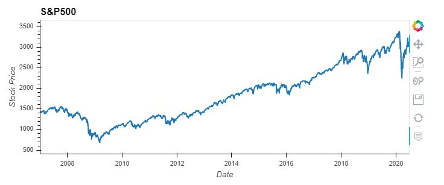
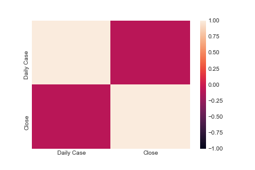
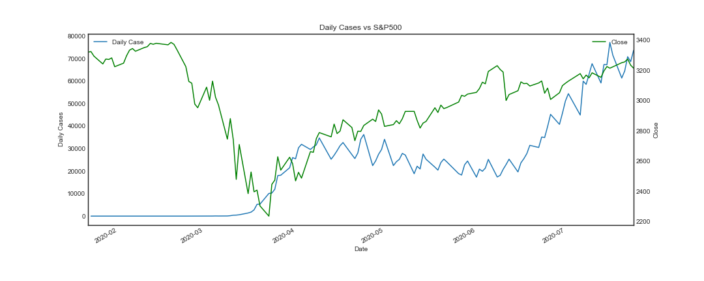
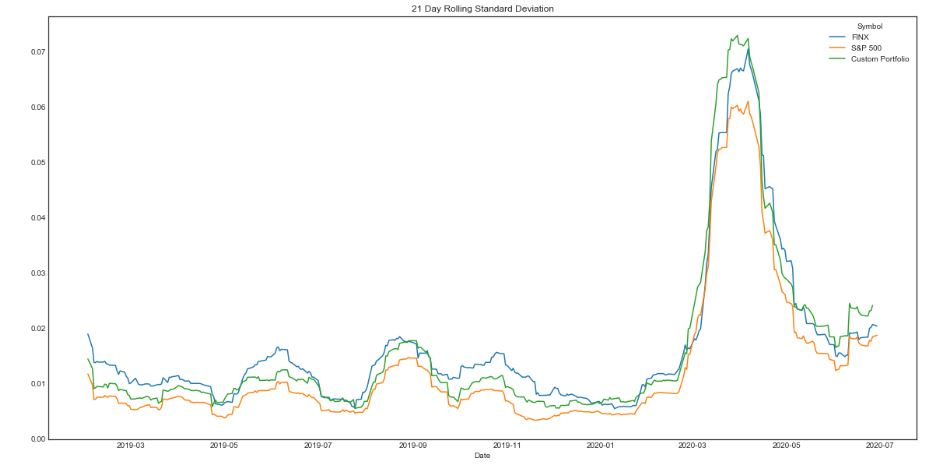
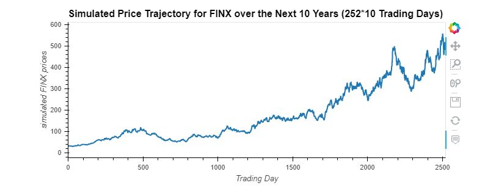
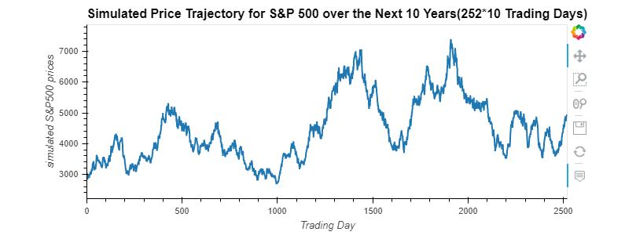
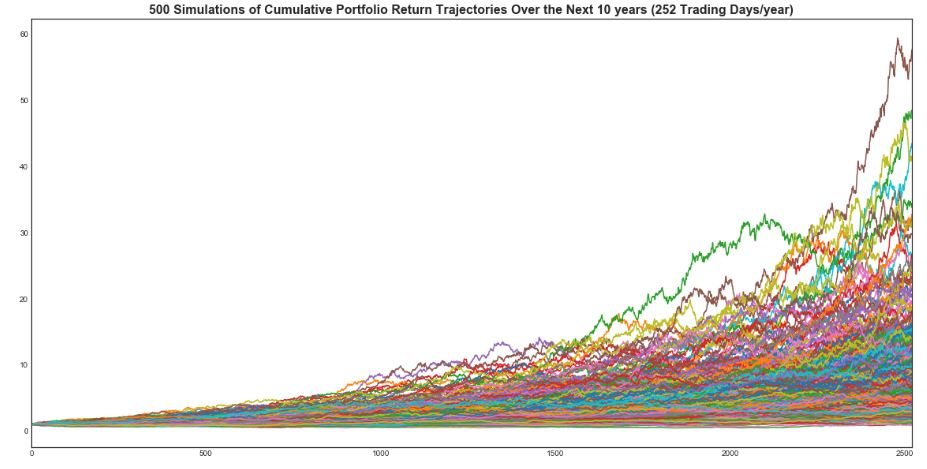
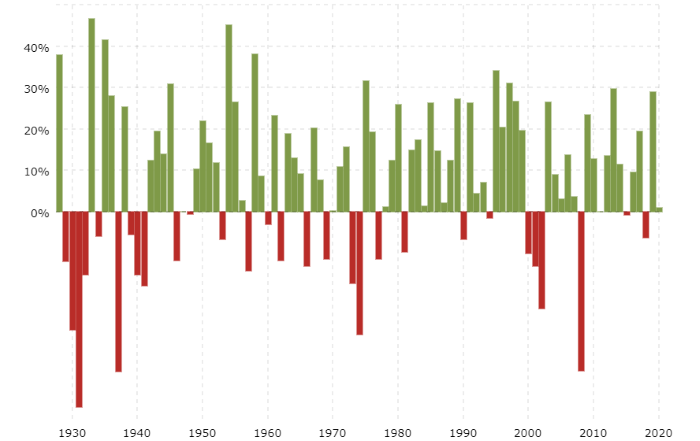

# Project_1 - Group # 3

## Impact of COVID-19: A Comparative Portfolio Analysis and a glimpse into the future

### Project Description:

As the Global pandemic continues to create uncertainity, the aim of this project is to study:

1. The Impact of COVID-19 so far on the stock market and portfolio earnings. 

2. As most epidemiologists are predicting the world will see another pandemic it is not a matter of whether but when. In light of such a scenario playing out again we asked the question what will happen in the next 10 years to the portfolio we decided on investing during this trying time.

We start with analyzing the S&P 500 from 2007 to 1H'20 highlighting episodes of stress starting from the global financial crisis of 2007/2008, corrections in 2018 and the COVID-19 market decline in Q1 2020. That said, as long-term investors who have navigated many episodes of stress, we know that this too shall pass.

We also looked at sector performances over time. 

</a><small>Source: <a href="https://novelinvestor.com/">novelinvestor.com</a></small>

With all the negative news around COVID-19 our attempt is to investigate if there is a positive impact on portfolio earnings between January 2019 to June 2020. The 18 month timeframe has been chosen to represent pre COVID-19 to present time. 

A comparative analysis was done to study the COVID-19 impact
on a custom portfolio of 5 dividend paying stocks chosen from a list of top 25 S&P 500 companies. This portfolio is compared with a Fintech ETF representing the sector showing tremendous potential for growth due to the increase in use of digital financial services and e-commerce. Last, the S&P 500 Index is used as a benchmark for assessing trends in the stock market.

Lastly, an attempt to predict what will happen to the custom portfolio and the Fintech ETF in the next 10 years in the light of the fact that there will be another pandemic like situation.

### Questions Posed for Analysis

1. What is the Impact of COVID 19 on the stock market?

   We studied the S&P 500 as a representative of the stock markets.  The S&P 500 achieved a record closing high of 3,386 on February 19, 2020. However, just over three weeks later, the market closed on 2,480, which represented a decline of around 26 percent in only 16 sessions due to the COVID-19 scare. This is evident from the correlation between market performance and COVID cases.

    

   Policy actions across the globe, both in terms of monetary and fiscal stimulus packages, have cushioned the economic damage and paved the road to recovery.The S&P 500 has gained strength based on a Federal Government stimulus package and the Federal Reserve rate cuts. The S&P 500 closed Q2 2020 up 19.95% accounting for its best quarter since Q4 1998 when the index gained 20.87%. As is shown in the plot below the markets plunged initially with the rise in COVID-19 cases but have since recovered considerably.

   

2. What is the effect of COVID 19 on the sectors represented in the custom portfolio?

   Our choice of stocks in the custom portfolio was based on sector diversification. The 5 stocks part of the portfolio represent the following sectors:

   #### Information Technology

    

    Source: *www.freepik.com*

   The technology industry is well positioned to ride out the crisis. Technology firms will likely need to evaluate impacts on three fronts: supply chain, market demand and employees.  
   In the short-term, supply disruption will reduce manufacturing and assembly capacity, plant reopenings will be further delayed by lags in component supply, and travel bans will exacerbate workforce shortages and consumer demand. The good news is High tech companies are set up for remote work more than other industries and so will suffer less of a workplace culture shock.

   The shift to working from home with the help of digital collaboration tools is likely to drive demand for High tech in many categories. A growing need for infrastructure to support this shift, like cloud computing for business or increased broadband consumption for consumers, will be a boon to the industry.

   #### Healthcare
   
   

   Source: *www.freepik.com*

   The Health Care Sector encompasses two main industry groups. The first includes companies who manufacture health care equipment and supplies or provide health care related services. The second group of companies are primarily involved in the research, development, production and marketing of pharmaceuticals and biotechnology products.

   The coronavirus pandemic has put health care at the forefront, but it has also put a lot of economic activity from it on hold. Despite a surge in the use of telemedicine, the massive pullback in services hit the health-care sector hard, with hospitals, outpatient surgical centers and doctor’s offices all reporting big losses and cutting jobs as revenues dried up. 
   
   However, the industry impact will be mild compared to disruptions in certain other sectors. Drugmakers whose products are effective against COVID-19 will benefit financially. It is expected that there will be greater investment in pandemic prevention to help the industry in coming years.
   
   #### Communication Services

   

   Source: *www.freepik.com*
   
   The pandemic has demonstrated the critical importance of the integration of telecommunications infrastructure within workplaces by keeping businesses, governments, and societies connected and running. The communications sector has remained “mission-critical” to keep economies moving under the lockdown in at least three different ways: 

   1. Providing business-critical connectivity and resiliency; 
   2. Facilitating work-from-home arrangements; 
   3. Keeping individuals and societies connected and informed, with access to medical, financial, commercial, and other essential services during mandated social isolation.

   Communications and Media organizations are rapidly responding to the economic and social impact of COVID-19. Despite a continuing spike in usage, Communications Service Providers (CSPs) are supporting provisioning of capacity to enable mission critical services to run undisrupted, something that is being recognized by consumers and businesses alike. Media organizations are also witnessing a surge in demand, as they inform, educate and entertain a public increasingly confined to their homes while also having to rapidly develop content contingency plans as live events and studio production grind to a halt. Companies in both industries have a unique opportunity now to fundamentally change their relationship and intimacy with customers by taking appropriate action. 

   #### Financials

   

   Source: *www.freepik.com*

   Central banks are expected to keep rates low or negative for several more years, which has the potential to reduce banks’ profits and labour needed. The outcome of reduced interest rates, business activity, and large scale non-performing loans, has the potential to become a significant contributing factor to a prolonged recession. The IMF chief has called the current business environment “recessionary”.

   The pandemic will accelerate the shift to digital processes and services for both consumers and firms. The COVID-19 crisis is an opportunity for banks to show they understand their customers and are committed to helping them deal with its impacts, building stronger, enduring, trust-based relationships. The trend is for re-bundling multiple banking, payments, and investment services to monetize customer acquisition costs. ‍

   #### Energy

   

   Source: *www.freepik.com*

   Between February 2020 and March 2020 the petroleum industry had experienced a 40% drop in price due to the outbreak; however, it was not the only factor contributing to the sharp international decline of oil prices. Saudi Arabia and Russia were not able to resolve the dispute of whether or not to cut back on oil production to match the decreasing demand of gas.
   
   Due to a lack of demand from travel restrictions, and without the decrease of production, the Oil and Gas industry was drastically impacted. Many countries rely on petroleum revenue just as much as energy companies do; both these dependents have been facing disaster with labour lay-offs, decrease in family income, drop in employment and less household spending.
 
3. How has COVID19 affected the Fintech space?

   

   Source: *www.freepik.com*

    There are major differences and nuances in how fintech sub-sectors respond to a distressed market. Analysis indicates that lending fintechs would suffer the biggest drop (lower valuations, slower funding), followed by capital markets.

    Insurance and payments would be less impacted. B2C fintech models (e.g. challenger banks) that have been very popular in the last few years will see valuations contract faster than B2B models (e.g. capital markets, corporate banking, treasury).

    Although COVID-19 continues to create uncertainty, the story is a little different for the big fintech companies. As the economy shows a sign of slow recovery, many big fintech companies utilize their skills and technologies to create new opportunities to adapt to our current market.
    
    FinTech must be prepared not just to accommodate this increased demand but also to scale up their enterprise IT infrastructure while adapting to the new world, just like everyone else. ‍

    Capital markets fintechs focused on better managing risk and lowering costs (outsourced trading, cloud-based delivery) will gain favor as brokers and asset managers cut costs to maintain margins. Regtech and compliance fintechs will remain popular as a market dislocation doesn’t impact demand for their services. Investors may double down on these investments, boosting their valuations. They may be one of the few bright spots in an otherwise tough fintech market.

4. What are the key takeaways from the analysis of portfolio stocks, Fintech ETF and the overall market now and ten years down the road?

   #### Custom Portfolio

   The custom portfolio of stocks were chosen based on high dividend payments and sector diversification. The individual stocks performances are:   
   
   

   Based on this chart Microsoft has had a swift recovery followed by JP Morgan. Telecommunication stocks are expected to do well but based on this plot energy stock Exxon outperformed AT&T. Portfolio composition:

   | Company               | Ticker  | Weight  |
   |-----------------------| --------|---------|
   |Microsoft Corporation  | MSFT    |  40%    |
   |JP Morgan Chase & Co.  | JPM     |  20%    |
   |Exxon Mobil Corporation| XOM     |  20%    |
   |Pfizer Inc.            | PFE     |  10%    |
   |AT&T Inc.              | T       |  10%    |
   
    #### Fintech ETF

    GLB X FUNDS/FINTECH THEMATIC ETF(FINX) the oldest and most established fintech ETF has been chosen to represent an industry showing the most promise in these difficult times.

    

    There has been a 47.33% appreciation between January 2019($22.14) to June 2020($32.62).

    #### Comparative Analysis of Custom Portfolio, Fintech ETF and S&P 500

    - **Daily & Cumulative Returns**: Daily returns show higher variations in returns for the custom portfolio whereas the cumulative returns show that both FINX and Custom portfolio outperformed the benchmark S&P 500. 

    
    

    - **Risk Analysis**: The standard deviation as well as the rolling 21-day standard deviation both show that the custom portfolio is more risky than FINX and the market.    

       - FINX - 0.021597
       - S&P 500 - 0.017911
       - Custom Portfolio - 0.021822

      

    - **Sharpe Ratios**: Based on return-to-risk one can note that the Fintech ETF had the highest Sharpe ratio.

       

    #### 10-year performance of Custom portfolio, FINX ETF and the S&P 500: 

    Governments around the globe have already committed about $8 trillion to address the health, social and economic ravages of the COVID-19 pandemic. This price tag (which continues to grow) includes direct spending, equity injections, loans and guarantees. It is more than four times what all the countries on the planet collectively spent on military, weapons and war in 2019. It is a staggering 9.5% of pre-COVID global GDP.

    As we deal with and recover from this pandemic, we need to do so in a way that better prepares us to deal with future pandemics and other unpredictable but inevitable large-scale disasters, like very big earthquakes, tsunamis and hurricanes. 

    In the last 20 years, we've had six significant threats like SARS, MERS, Ebola, avian influenza and swine flu. One can therefore predict that there is no doubt we will see another stock market crash due to a large-scale disaster. 
    
    We don't know when the next market crash will happen. It is inevitable but we cannot predict with certainity but we can prepare for the future. Keeping that in mind, we have made an attempt to evaluate the performance of our custom portfolio, the fintech ETF and the S&P 500 for the next 10 years.

    #### Monte Carlo Simulations:
    We performed Monte Carlo simulations on FINX ETF, S&P 500 and the custom portfolio for the next 10 years using historical data to perform a normally distributed random selection based on the sample mean and standard deviation of historical daily returns. 

    

    Based on the simulations the target price for FINX after 10 years at a 90% confidence interval would be in the range of $40.69 - $539.93. The median price being $286.56 giving a return of 718.98% from the current price of $34.99(July 28, 2020)

    

    Based on the simulations, the target for S&P 500 after 10 years at a 90% confidence interval would be in the range of 2,484.59 - 10,045.66. The median being 5,696.54 giving a return of 77% from the current level of 3,218.44(July 28, 2020) 

    

    Based on the simulations the returns for Custom Portfolio after 10 years at a 90% confidence interval would be in the range of 2.19% - 20.04%. The median being 6.93%.

    #### Actions to take before the next crash:
    
    How can we get ready for another major event? We can do that by keeping cash ready for 3 important things:

    - **Emergency Savings**:  Recessions, job losses, illnesses, natural disasters, and a lot of other things can happen unexpectedly. In addition to having appropriate kinds of and amounts of insurance, you should aim to have cash savings that can cover six or more months of basic living expenses.

    - **Expected expenses**: While your emergency savings is preparing for unexpected near-term needs, one should also prepare your portfolio for those expected needs coming up soon. Investments away from stocks and into high-quality bonds. The goal is having a few years' expenses in these low-volatility assets before you need them.

    - **Investing to profit from the next crash**:Setting aside cash to invest in the next crash. A small portion of ones portfolio say 5% of what would normally be investment in stocks can be held in cash to invest when the market drops quickly.
    
    Investing half this cash when stocks fall 10% from a recent high, investing half of the remaining cash when stocks fall 20% and the rest at the 30% drop.

    Stock market history shows that we see 10% declines about once every year or two, 20% declines about once every five to seven years; a 30% decline has happened only six times. Going by history, one can use this probability to take advantage of future downturns in the market.

    **S&P 500 Historical Annual Returns**

     
     Source: *https://www.macrotrends.net/2526/sp-500-historical-annual-returns*

### Data Used for Analysis

1. Out of a list of [Top 25 S&P 500](image/stock_list.png) companies, 5 stocks were chosen(highlighted) based on high dividend payments and sector diversification. 

2. Global X fintech ETF the oldest and most established fintech ETF was chosen from a list of [Top ETFs](image/etf_list.png).

3. COVID-19 API was used for coronavirus data for USA.

4. Tabulate was used to Pretty-print tabular data in Python, a library and a command-line utility.

### Limitations

- Past performance is no indication of future performance, no one can say whether the stock market will perform the same way in the next 10 years. However, one can use past performance to create some hypothetical scenarios that allow you to consider possible outcomes. 

- The method of picking the stocks in the custom portfolio could have been better based on thorough analysis of company information and industry performance.

- Reviewing past financial crises data and market reactions to better study the COVID impact.

### References:

https://www.spglobal.com/ratings/en/research/articles/200316-pharma-industry-only-moderately-affected-while-helping-mitigate-covid-19-pandemic-impact-11391384

https://www.accenture.com/ca-en/services/consulting/coronavirus-industry-impact

https://fintech-bulletin.com/the-impact-of-covid-19-on-different-fintech-sectors/

https://www.forbes.com/sites/chunkamui/2020/05/07/5-ways-our-coronavirus-recovery-strategies-might-make-or-break-the-future-part-1/#1f82c7c212b4

https://www.bbc.com/news/science-environment-52775386

https://www.fool.com/investing/2020/06/06/yes-another-stock-market-crash-is-coming-how-to-be.aspx

https://finance.yahoo.com/news/where-p-500-2030-heres-193118911.html

https://www.investopedia.com/articles/personal-finance/022216/put-10000-sp-500-etf-and-wait-20-years.asp

https://primexbt.com/blog/s-p-500-price-prediction-forecast/

https://thefinancialbrand.com/96254/covid-19-impact-future-fintech-banking/

https://www.kaggle.com/gauravarena/canada-covid-19-impact-analysis

https://www.pwc.com/us/en/library/covid-19/coronavirus-technology-impact.html

https://www2.deloitte.com/global/en/pages/about-deloitte/articles/covid-19/understanding-covid-19-s-impact-on-the-technology-sector-.html

https://www.marketdataforecast.com/blog/impacts-of-covid19-on-information-technology-industry

https://www.investmentexecutive.com/news/research-and-markets/the-financial-industry-will-be-fundamentally-transformed-by-covid-19/

https://www.tcs.com/content/dam/tcs/pdf/Industries/Banking%20and%20Financial%20Services/COVID-19-Crisis-Implications-for-financial-services-industry.pdf

https://www2.deloitte.com/global/en/pages/about-deloitte/articles/covid-19/covid-19-s-impact-on-banking---capital-market-institutions-.html

https://www.cbinsights.com/research/fintech-covid-outlook/

https://www.accenture.com/_acnmedia/PDF-126/Accenture-COVID-19-Communications-Media-Industry-Report-5.pdf
